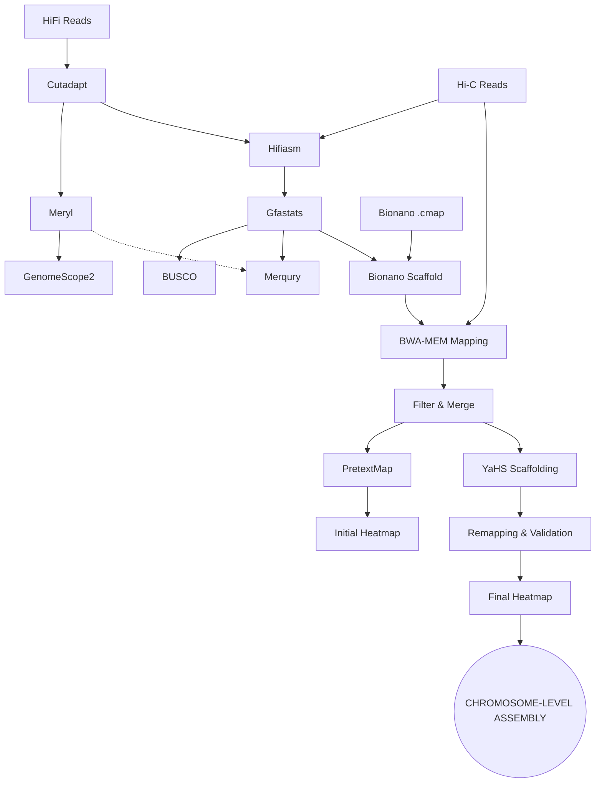

# Data Processing Registry: Inputs, Tools, and Outputs

This reference table tracks the transformation of data through each technical checkpoint of the VGP pipeline.

## Phase 1: Pre-processing & Genomic Characterization

| Step | Input Source | Tool / Operation | Primary Output |
| :--- | :--- | :--- | :--- |
| **1** | Raw HiFi Collection (3 × FASTA) | **Cutadapt** (Adapter Trimming) | Cleaned HiFi Collection |
| **2a** | Cleaned HiFi Collection | **Meryl** (K-mer Counting, k=31) | Set of 3 `meryldb` files |
| **2b** | `meryldb` collection | **Meryl** (Union-Sum Merge) | Unified `meryldb` |
| **2c** | Unified `meryldb` | **Meryl** (Histogram Generation) | K-mer frequency histogram |
| **3** | K-mer Histogram | **GenomeScope2** (Profiling) | `summary.txt` & Profile plots |

## Phase 2: Assembly Reconstruction

| Step | Input Source | Tool / Operation | Primary Output |
| :--- | :--- | :--- | :--- |
| **4** | Cleaned HiFi + R1/R2 Hi-C Data | **Hifiasm** (Phased Mode) | Hap1 & Hap2 Graphs (GFA) |
| **5a** | Hap1/Hap2 GFA | **Gfastats** (Format Conversion) | Hap1/Hap2 FASTA |
| **5b** | Hap1/Hap2 GFA | **Gfastats** (Summary Stats) | Assembly statistics (N50, etc) |
| **5c** | Hap1/Hap2 Stats | **Data Integration** (Column Join) | Comparative assembly report |

## Phase 3: Quality Validation

| Step | Input Source | Tool / Operation | Primary Output |
| :--- | :--- | :--- | :--- |
| **6** | Hap1/Hap2 FASTA | **BUSCO** (Saccharomycetes) | Lineage completeness reports |
| **7** | Unified `meryldb` + Hap1/Hap2 FASTA | **Merqury** (K-mer Evaluation) | CN/ASM plots & reliability stats |

## Phase 4: Scaffolding & Chromosomal Integration

| Step | Input Source | Tool / Operation | Primary Output |
| :--- | :--- | :--- | :--- |
| **8a** | External Zenodo URL | **Galaxy Upload** | Bionano Reference (`.cmap`) |
| **8b** | Hap1 FASTA + Bionano Dataset | **Bionano Hybrid Scaffold** | Scaffolds & Unplaced Contigs |
| **8c** | Bionano Output Files | **Dataset Concatenation** | Consolidated Hap1 Bionano Assembly |
| **8d** | Bionano Assembly | **Gfastats** | Scaffolding quality metrics |
| **9/10** | Hap1 Bionano + Hi-C (Forward/Reverse) | **BWA-MEM** (Independent Mapping) | Forward & Reverse BAM files |
| **10b** | Forward & Reverse BAM | **Arima Filter & Merge** | Validated Hi-C BAM |
| **11a** | Hi-C BAM | **PretextMap** | Unsorted contact matrix |
| **11b** | Pretext Binary | **Pretext Snapshot** | **Initial Contact Map (PNG)** |
| **12** | Bionano Assembly + Hi-C BAM + DPNII | **YaHS** (Hi-C Scaffolding) | Chromosome-scale Scaffolds |
| **13** | YaHS Scaffolds + Hi-C Reads | **BWA-MEM / Filter / Merge** | Final Alignment Map |
| **14a** | Final Alignment Map | **PretextMap** | Final contact matrix |
| **14b** | Final Pretext Binary | **Pretext Snapshot** | **Final Contact Map (PNG)** |

---

## Comprehensive Data Flow Logic

